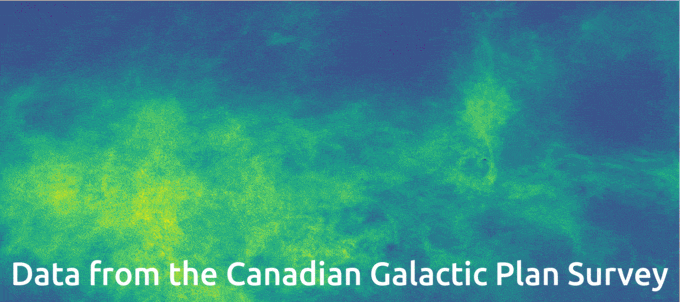
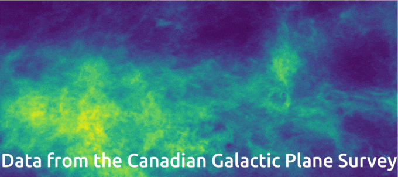

# The Rustronomy watershed - a pure rust implementation of the segmenting and merging watershed algorithms
[](https://joinup.ec.europa.eu/collection/eupl/eupl-text-eupl-12)
[](https://crates.io/crates/rustronomy-watershed)

>[_This crate is part of the Rustronomy Project_](https://github.com/smups/rustronomy)

Rustronomy-watershed is a pure-rust implementation of the segmenting and merging
watershed algorithms (see Digabel & Lantuéjoul, 1978[^1]).

## Features [(read the docs)](https://docs.rs/rustronomy-watershed/)
Two main versions of the watershed
algorithm are included in this crate.
1. The *merging* watershed algorithm, which is
a void-filling algorithm that can be used to identify connected regions in image.
2. The *segmenting* watershed algorithm, which is a well-known image segmentation algorithm.

In addition, `rustronomy-watershed` provides extra functionality which can be
accessed via cargo feature gates. A list of all additional features [can be found
below](#cargo-feature-gates).

# Gallery
*Merging watershed algorithm in action*


*Segmenting watershed algorithm in action*


# Quickstart
To use the latest release of Rustronomy-watershed in a cargo project, add the rustronomy-watershed crate as a dependency to your `Cargo.toml` file:
```toml
[dependencies]
rustronomy-watershed = "0.1.0"
```
To use Rustronomy-fits in a Jupyter notebook, execute a cell containing the following code:
```rust
:dep rustronomy-watershed = {version = "0.1"}
```

> Please do not use any versions before 0.3, as they contain a major bug in the implementation of the merging watershed algorithm

If you want to use the latest (unstable) development version of `rustronomy-watershed`, you can do so by using the `git` field (which fetches the latest version from the repo) rather than the `version` field (which downloads the latest released version from crates.io). 
```
{git = "https://github.com/smups/rustronomy-watershed"}
```
## Short example: computing the Watershed transform of a random field
In this example, we compute the watershed transform of a uniform random field.
The random field can be generated with the `ndarray_rand` crate. To configure a
new watershed transform, one can use the `TransformBuilder` struct which is
included in the `rustronomy_watershed` prelude.
```rust
use rustronomy_watershed::prelude::*;
use ndarray_rand::{rand_distr::Uniform, RandomExt};

//Create a random uniform distribution
let rf = nd::Array2::<u8>::random((512, 512), Uniform::new(0, 254));
//Set-up the watershed transform
let watershed = TransformBuilder::new_merging().build().unwrap();
//Find minima of the random field (to be used as seeds)
let rf_mins = watershed.find_local_minima(rf.view());
//Execute the watershed transform
let lakes = watershed.transform(rf.view(), &rf_mins)
```
# Cargo feature gates
*By default, all features behind cargo feature gates are **disabled***
- `jemalloc`: this feature enables the [jemalloc allocator](https://jemalloc.net).
From the jemalloc website: *"jemalloc is a general purpose `malloc`(3) implementation that emphasizes fragmentation avoidance and scalable concurrency support."*. Jemalloc
is enabled though usage of the `jemalloc` crate, which increases compile times considerably. However, enabling this feature can also greatly improve run-time performance, especially on machines with more (>6 or so) cores. To compile
`rustronomy-watershed` with the `jemalloc` feature, jemalloc must be installed
on the host system.
- `plots`: with this feature enabled, `rustronomy-watershed` will generate a plot
of the watershed-transform each time the water level is increased. See the crate
level docs for details on how to use this feature. Plotting support adds the
`plotters` crate as a dependency, which increases compile times and requires the
installation of some packages on linux systems, [see the `plotters` documentation
for details](https://docs.rs/plotters/).
- `progress`: this feature enables progress bars for the watershed algorithm.
Enabling this feature adds the `indicatif` crate as a dependency, which should not
considerably slow down compile times.
- `debug`: this feature enables debug and performance monitoring output. This
can negatively impact performance. Enabling this feature does not add additional
dependencies.


# License
[](https://joinup.ec.europa.eu/collection/eupl/eupl-text-eupl-12)

All crates in the Rustronomy ecosystem are licensed under the EUPLv1.2 (or higher)
license.
>**Rustronomy-watershed is explicitly not licensed under the dual
Apache/MIT license common to the Rust ecosystem. Instead it is licensed under
the terms of the [European Union Public License v1.2](https://joinup.ec.europa.eu/collection/eupl/eupl-text-eupl-12)**.

Rustronomy is a science project and embraces the values of open science and free
and open software. Closed and paid scientific software suites hinder the
development of new technologies and research methods, as well as diverting much-
needed public funds away from researchers to large publishing and software
companies.

See the [LICENSE.md](../LICENSE.md) file for the EUPL text in all 22 official
languages of the EU, and [LICENSE-EN.txt](../LICENSE-EN.txt) for a plain text
English version of the license.

[^1]: H. Digabel and C. Lantuéjoul. **Iterative algorithms.** *In Actes du Second Symposium Européen d’Analyse Quantitative des Microstructures en Sciences des Matériaux, Biologie et Medécine*, October 1978.